# 2️⃣ ARQUITETURA - Referência Técnica

> **Propósito**: Documentação técnica completa da arquitetura do projeto  
> **Audiência**: Desenvolvedores implementando features  
> **Última Atualização**: Dezembro 2025

---

## 📚 Stack Tecnológico

| Tecnologia | Versão | Propósito |
|------------|--------|-----------|
| **Kotlin** | 1.9+ | Linguagem principal (100%) |
| **Jetpack Compose** | Latest | UI moderna (35.8% migrado) |
| **Material Design 3** | Latest | Tema e componentes |
| **Room** | 2.6+ | Banco de dados local |
| **Hilt** | 2.48+ | Injeção de dependência |
| **StateFlow** | Kotlin Coroutines | Observação reativa |
| **Navigation Component** | 2.7+ | Navegação type-safe |
| **WorkManager** | 2.9+ | Background tasks |
| **Firebase Firestore** | BOM 32.7.4 | Backend/Sincronização |
| **Firebase Crashlytics** | BOM 32.7.4 | Rastreamento de crashes |
| **Firebase Analytics** | BOM 32.7.4 | Análise de uso |
| **Firebase Performance** | BOM 32.7.4 | Monitoramento de performance |
| **Firebase Remote Config** | BOM 32.7.4 | Configuração remota |
| **Timber** | 5.0.1 | Sistema de logging |

---

## 🏗️ Arquitetura MVVM

### Diagrama de Camadas


### Princípios

1. **Offline-First**: Room como fonte primária de verdade
2. **Unidirectional Data Flow**: UI → ViewModel → Repository → DAO
3. **Reactive**: StateFlow para observação de mudanças
4. **Single Source of Truth**: Banco local sempre atualizado
5. **Separation of Concerns**: Cada camada tem responsabilidade única

---

## 📦 Modularização Gradle

### Estrutura

```
:app              # Entry point, DI setup
  ├── MainActivity
  ├── GestaoBilharesApplication
  └── di/
  
:core             # Utilitários compartilhados
  ├── utils/
  ├── extensions/
  └── constants/
  
:data             # Camada de dados
  ├── entities/   # Room entities
  ├── dao/        # Room DAOs
  ├── repository/ # Repositories + AppRepository
  └── database/   # Database setup
  
:ui               # Camada de apresentação
  ├── viewmodel/  # ViewModels
  ├── fragment/   # Fragments (legacy)
  ├── compose/    # Compose screens
  └── adapter/    # RecyclerView adapters
  
:sync             # Sincronização
  ├── SyncRepository
  ├── SyncWorker
  ├── SyncManager
  └── queue/
```

### Dependências

```kotlin
// :app
dependencies {
    implementation(project(":core"))
    implementation(project(":data"))
    implementation(project(":ui"))
    implementation(project(":sync"))
}

// :ui
dependencies {
    implementation(project(":core"))
    implementation(project(":data"))
}

// :sync
dependencies {
    implementation(project(":core"))
    implementation(project(":data"))
}

// :data
dependencies {
    implementation(project(":core"))
}
```

---

## 🗄️ Banco de Dados (Room)

### Entidades Principais

#### Diagrama ER


### Entidades Completas (27 total)

**Core Business**:
- `Cliente`, `Mesa`, `Rota`, `Acerto`, `CicloAcerto`
- `ContratoLocacao`, `AditivoMesa`, `ContratoMesa`
- `Despesa`, `CategoriaDespesa`, `TipoDespesa`
- `Colaborador`, `ColaboradorRota`, `Meta`, `MetaColaborador`

**Estoque e Veículos**:
- `Equipment`, `PanoEstoque`, `StockItem`, `PanoMesa`
- `MesaVendida`, `MesaReformada`, `HistoricoManutencaoMesa`
- `Veiculo`, `HistoricoCombustivelVeiculo`, `HistoricoManutencaoVeiculo`

**Sistema**:
- `AssinaturaRepresentanteLegal`, `SignaturePoint`
- `LogAuditoria`, `SyncMetadata`, `SyncOperation`

### Índices Importantes

```kotlin
@Entity(
    tableName = "clientes",
    indices = [
        Index(value = ["rotaId"]),           // Filtro por rota
        Index(value = ["dataAtualizacao"]),  // Sync incremental
        Index(value = ["nome"])              // Busca
    ]
)
data class Cliente(...)

@Entity(
    tableName = "acertos",
    indices = [
        Index(value = ["clienteId", "dataAcerto"])  // Histórico
    ]
)
data class Acerto(...)
```

---

## 🔄 Sincronização (Offline-First)

### Estratégia

```mermaid
graph LR
    A[Operação Local] --> B{Online?}
    B -->|Não| C[Salvar no Room]
    B -->|Sim| C
    C --> D[Enfileirar Sync]
    D --> E{WorkManager}
    E --> F[Processar Fila]
    F --> G[Push → Firestore]
    G --> H[Pull ← Firestore]
    H --> I[Atualizar Room]
```



### Componentes

#### SyncRepository
```kotlin
class SyncRepository @Inject constructor(
    private val appRepository: AppRepository,
    private val syncMetadataDao: SyncMetadataDao,
    private val firestore: FirebaseFirestore
) {
    // Sincronização bidirecional
    suspend fun syncBidirectional(): Result<Int>
    
    // Pull incremental (servidor → local)
    suspend fun syncPull(): Result<Int>
    
    // Push incremental (local → servidor)
    suspend fun syncPush(): Result<Int>
    
    // Processar fila de operações
    suspend fun processSyncQueue(): Result<Unit>
}
```

#### Fila de Sincronização

```kotlin
@Entity(tableName = "sync_operations")
data class SyncOperation(
    @PrimaryKey(autoGenerate = true) val id: Long = 0,
    val operationType: OperationType, // CREATE, UPDATE, DELETE
    val entityType: String,           // "Cliente", "Acerto", etc.
    val entityId: String,             // ID da entidade
    val entityData: String,           // JSON
    val status: SyncStatus,           // PENDING, PROCESSING, COMPLETED, FAILED
    val retryCount: Int = 0,
    val createdAt: Date,
    val lastAttempt: Date? = null
)
```

### Sincronização Incremental

**Objetivo**: Reduzir uso de dados em 98.6%

**PULL** (Servidor → Local):
```kotlin
// 1. Obter último timestamp de sync
val lastSync = syncMetadataDao.getLastSyncTimestamp("clientes")

// 2. Query incremental no Firestore
val query = clientesRef
    .whereGreaterThan("lastModified", lastSync)
    .orderBy("lastModified")
    .limit(500) // Paginação

// 3. Processar e atualizar Room
query.get().forEach { doc ->
    val cliente = doc.toObject<Cliente>()
    clienteDao.upsert(cliente) // Insert or Update
}

// 4. Salvar novo timestamp
syncMetadataDao.saveSyncMetadata("clientes", System.currentTimeMillis())
```

**PUSH** (Local → Servidor):
```kotlin
// 1. Obter último timestamp de push
val lastPush = syncMetadataDao.getLastPushTimestamp("clientes")

// 2. Filtrar entidades modificadas localmente
val clientesModificados = clienteDao.obterModificadosDesde(lastPush)

// 3. Enviar para Firestore
clientesModificados.forEach { cliente ->
    clientesRef.document(cliente.id.toString()).set(cliente)
}

// 4. Atualizar timestamp local
syncMetadataDao.savePushMetadata("clientes", System.currentTimeMillis())
```

### WorkManager

```kotlin
class SyncWorker(context: Context, params: WorkerParameters) : CoroutineWorker(context, params) {
    override suspend fun doWork(): Result {
        return try {
            syncRepository.syncBidirectional()
            Result.success()
        } catch (e: Exception) {
            if (runAttemptCount < 3) Result.retry() else Result.failure()
        }
    }
}

// Agendamento (em Application)
val constraints = Constraints.Builder()
    .setRequiredNetworkType(NetworkType.UNMETERED) // Wi-Fi
    .setRequiresBatteryNotLow(true)
    .setRequiresCharging(false)
    .build()

val syncRequest = PeriodicWorkRequestBuilder<SyncWorker>(6, TimeUnit.HOURS)
    .setConstraints(constraints)
    .build()

WorkManager.getInstance(context).enqueueUniquePeriodicWork(
    "sync", ExistingPeriodicWorkPolicy.KEEP, syncRequest
)
```

### Estrutura Firestore

```
empresas/
  └── empresa_001/
      └── entidades/
          ├── clientes/items/{clienteId}
          ├── rotas/items/{rotaId}
          ├── mesas/items/{mesaId}
          ├── acertos/items/{acertoId}
          ├── despesas/items/{despesaId}
          └── ... (27 coleções)
```

---

## 🎨 Padrões de Código

### ViewModel com StateFlow

```kotlin
@HiltViewModel
class ClientListViewModel @Inject constructor(
    private val appRepository: AppRepository
) : ViewModel() {
    // ✅ RECOMENDADO: MutableStateFlow + flatMapLatest
    private val _rotaId = MutableStateFlow<Long?>(null)
    
    val clientes: StateFlow<List<Cliente>> = _rotaId
        .flatMapLatest { id ->
            id?.let { appRepository.obterClientesPorRota(it) }
                ?: flowOf(emptyList())
        }
        .stateIn(viewModelScope, SharingStarted.Lazily, emptyList())
    
    fun loadRota(rotaId: Long) {
        _rotaId.value = rotaId // Atualiza, dispara observação automática
    }
}
```

### Repository Pattern

```kotlin
class ClienteRepository @Inject constructor(
    private val clienteDao: ClienteDao
) {
    // ✅ Flow reativo (Room observa mudanças automaticamente)
    fun obterPorRota(rotaId: Long): Flow<List<Cliente>> =
        clienteDao.obterPorRota(rotaId)
    
    suspend fun inserir(cliente: Cliente) = withContext(Dispatchers.IO) {
        clienteDao.insert(cliente)
    }
    
    suspend fun atualizar(cliente: Cliente) = withContext(Dispatchers.IO) {
        clienteDao.update(cliente)
    }
}
```

### Compose Screen

```kotlin
@Composable
fun ClientListScreen(
    viewModel: ClientListViewModel = hiltViewModel(),
    navController: NavController
) {
    val clientes by viewModel.clientes.collectAsStateWithLifecycle()
    
    LazyColumn {
        items(
            items = clientes,
            key = { it.id } // Importante para performance
        ) { cliente ->
            ClientCard(
                cliente = cliente,
                onClick = { navController.navigate("client_detail/${cliente.id}") }
            )
        }
    }
}
```

### Fragment (Legacy)

```kotlin
@AndroidEntryPoint
class ClientListFragment : Fragment() {
    private val viewModel: ClientListViewModel by viewModels()
    
    override fun onViewCreated(view: View, savedInstanceState: Bundle?) {
        super.onViewCreated(view, savedInstanceState)
        
        viewLifecycleOwner.lifecycleScope.launch {
            viewLifecycleOwner.repeatOnLifecycle(Lifecycle.State.STARTED) {
                viewModel.clientes.collect { clientes ->
                    adapter.submitList(clientes)
                }
            }
        }
    }
}
```

---

## 🔥 Firebase (Monitoramento Completo)

### Crashlytics

```kotlin
// GestaoBilharesApplication.kt
class CrashlyticsTree : Timber.Tree() {
    override fun log(priority: Int, tag: String?, message: String, t: Throwable?) {
        if (priority < Log.WARN) return // Apenas WARN e ERROR
        
        FirebaseCrashlytics.getInstance().apply {
            log("$tag: $message")
            t?.let { recordException(it) }
        }
    }
}

// Uso
if (BuildConfig.DEBUG) {
    Timber.plant(Timber.DebugTree())
} else {
    Timber.plant(CrashlyticsTree())
}

// Em qualquer lugar
Timber.w("Aviso importante")
Timber.e(exception, "Erro crítico")
```

### Analytics

```kotlin
FirebaseAnalytics.getInstance(context).logEvent("settlement_created") {
    param("client_id", clienteId)
    param("value", totalValue)
}
```

### Performance Monitoring

```kotlin
val trace = FirebasePerformance.getInstance().newTrace("sync_pull")
trace.start()
try {
    syncRepository.syncPull()
} finally {
    trace.stop()
}
```

### Remote Config

```kotlin
val remoteConfig = FirebaseRemoteConfig.getInstance()
remoteConfig.setConfigSettingsAsync(
    remoteConfigSettings {
        minimumFetchIntervalInSeconds = if (BuildConfig.DEBUG) 3600 else 43200
    }
)

val defaults = mapOf(
    "sync_interval_minutes" to 15,
    "enable_new_sync_engine" to true
)
remoteConfig.setDefaultsAsync(defaults)

// Uso
val syncInterval = remoteConfig.getLong("sync_interval_minutes")
```

---

## 🔐 Segurança

### Assinatura Eletrônica (Lei 14.063/2020)

```kotlin
// Captura de assinatura com metadados
val signature = SignatureMetadata(
    bitmap = signatureView.getSignatureBitmap(),
    timestamp = System.currentTimeMillis(),
    deviceId = Settings.Secure.getString(resolver, Settings.Secure.ANDROID_ID),
    pressure = signatureView.averagePressure,
    velocity = signatureView.averageVelocity,
    hash = DocumentIntegrityManager.generateHash(contract)
)

// Validação
val isValid = SignatureStatistics.validate(signature)
LegalLogger.log("Assinatura capturada", signature)
```

### ProGuard/R8

```proguard
# Room
-keep class * extends androidx.room.RoomDatabase
-keep @androidx.room.Entity class *

# Firebase
-keep class com.google.firebase.** { *; }

# Kotlin
-dontwarn kotlin.**
```

---

## 📊 Métricas de Performance

| Métrica | Target | Status |
|---------|--------|--------|
| **Build Time** | < 5 min | ✅ 3 min |
| **APK Size** | < 50 MB | ✅ 45 MB |
| **Cold Start** | < 2s | ✅ 1.5s |
| **Frame Rate** | 60 FPS | ✅ |
| **Memory** | < 100 MB | ✅ 85 MB |
| **Battery** | < 5%/hora | ✅ 3% |

---

## 🔗 Referências

- [Android Architecture Guide](https://developer.android.com/topic/architecture)
- [Jetpack Compose](https://developer.android.com/jetpack/compose)
- [Hilt Documentation](https://developer.android.com/training/dependency-injection/hilt-android)
- [Room Database](https://developer.android.com/training/data-storage/room)
- [Firebase Android](https://firebase.google.com/docs/android/setup)
