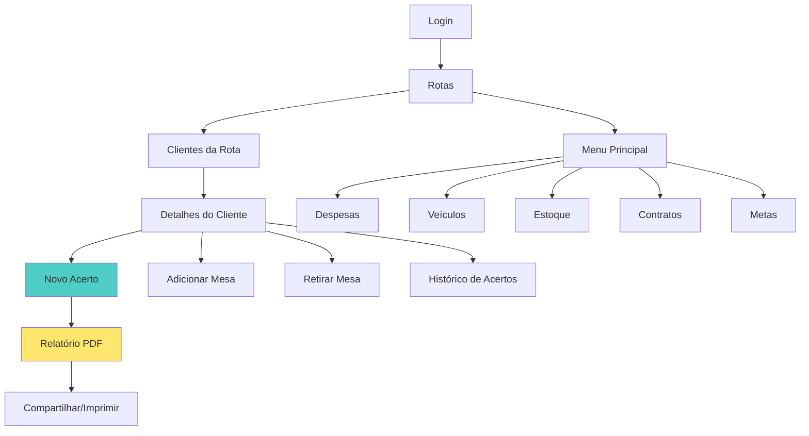

# 3️⃣ REGRAS DE NEGÓCIO

> **Propósito**: Lógica de negócio e fluxos da aplicação  
> **Audiência**: Desenvolvedores implementando features de negócio  
> **Última Atualização**: Dezembro 2025

---

## 🎯 Princípios Fundamentais

### 1. Offline-First
- App **DEVE** funcionar 100% offline
- Dados sempre disponíveis localmente (Room Database)
- Sincronização é complementar, **não bloqueante**
- Sem conexão = sem problema para o usuário

### 2. Centralização e Simplicidade
- **AppRepository como Facade**: Ponto único de acesso para ViewModels
- **Repositories Especializados**: Organizados por domínio de negócio
- **StateFlow Unificado**: Padrão consistente em toda aplicação
- **Observação Reativa**: Room Flows emitem mudanças automaticamente

### 3. Integridade de Dados
- **UPSERT**: Evita cascade delete acidental (Rotas, Clientes, Mesas)
- **Timestamps**: Resolução de conflitos (last-write-wins)
- **Validações**: Em todas as operações críticas
- **Auditoria**: Logs jurídicos para assinaturas eletrônicas

---

## 📱 Fluxo Principal da Aplicação

### Diagrama de Navegação



### Fluxo Detalhado

#### 1. TELA "ROTAS" (RoutesScreen - Compose)

**Card 1: Filtro de Acertos**
- Filtro horizontal para selecionar ciclo de acerto
- Lógica: Acertos são por rota (ex: "1º Acerto da Rota Zona Sul")
- Numeração anual: 1º ao 12º
- Estado padrão: Primeiro acerto do ano

**Card 2: Listagem de Rotas**
- Lista filtrada pelo ciclo selecionado
- Exibe: Título, Status, Faturamento, Clientes ativos, Mesas, Débitos, Pendências
- **Visibilidade**: Representantes veem apenas suas rotas
- **Menu principal**: Disponível para ADMIN aprovado e super admin (`rossinys@gmail.com`)

**Ações**:
- Selecionar rota → Navega para lista de clientes
- Botão sincronizar → Sincroniza dados com Firestore
- Menu principal → Acesso a funcionalidades administrativas

#### 2. TELA "CLIENTES DA ROTA" (ClientListScreen - Compose)

**Card 1: Informações da Rota**
- Nome da rota, pesquisa por cliente
- **Filtros**:
  - Débito alto (>R$300) - destaque vermelho
  - Sem acerto há 4+ meses - destaque amarelo
- **Botões**: "Iniciar Rota", "Finalizar Rota", "Novo Cliente"

**Card 2: Listagem de Clientes**
- **Cores**:
  - 🔴 Vermelho: Débito >R$300
  - 🟡 Amarelo: Sem acerto 4+ meses
  - 🟢 Verde: Demais clientes
- **Exibe**: Nome, endereço, débito, tempo desde último acerto
- **Ação**: Toque → Navega para detalhes

#### 3. TELA "DETALHES DO CLIENTE" (ClientDetailScreen - Compose)

**Card 1: Informações e Ações Rápidas**
- Número de mesas locadas
- **Botões**: WhatsApp, Telefone

**Card 2: Ações de Gerenciamento**
- **Novo Acerto**: Cria acerto com mesas do cliente
- **Adicionar Mesa**: Vincula nova mesa ao cliente
- **Retirar Mesa**: Solicita relógio final e valor recebido

**Card 3: Mesas do Cliente**
- Lista de mesas vinculadas
- Exibe: Número, tipo, relógio inicial/final
- Ação: Editar mesa

**Card 4: Histórico de Acertos**
- **Padrão**: Últimos 3 acertos (armazenados localmente)
- **Botão "Período Personalizado"**: Busca acertos mais antigos do Firestore
- **Otimização**: Economiza espaço local, busca sob demanda
- Exibe: Data, valor, status
- Ação: Ver detalhes do acerto

#### 4. TELA "ACERTO" (SettlementScreen - Compose)

**Card 1: Informações do Cliente**
- Nome, endereço, débito atual

**Card 2: Mesas do Acerto**
- Lista de mesas incluídas
- Edição de relógio inicial/final
- Cálculo automático de valores

**Card 3: Valores Financeiros**
- Total recebido
- Despesas de viagem
- Comissões:
  - 3% motorista
  - 2% Iltair
- **Total geral** = Total recebido - Despesas - Comissões

**Card 4: Métodos de Pagamento**
- PIX, Cartão, Cheque, Dinheiro
- Distribuição de valores
- **Validação**: Soma deve bater com total recebido

**Card 5: Observações**
- Campo de texto livre
- Foto opcional

**Ações**:
- **Salvar acerto** → Salva localmente (offline-first)
- **Gerar relatório** → PDF + compartilhamento WhatsApp
- **Imprimir** → Impressão direta

---

## 📋 Regras de Negócio por Domínio

### 🧑‍💼 Clientes

#### Cadastro
- ✅ Nome obrigatório
- ✅ CPF/CNPJ único
- ✅ Endereço completo obrigatório
- ✅ Vinculado a uma rota

#### Débitos
- **Cálculo automático** baseado em acertos
- **Destaque visual**: Débito >R$300 (vermelho)
- **Alertas**: Cliente sem acerto há 4+ meses (amarelo)
- **Fórmula**: Débito = Total de fichas - Total pago

#### Mesas
- Cliente pode ter **múltiplas mesas**
- Cada mesa tem **relógio inicial/final**
- Valores calculados automaticamente: `(relógio_final - relógio_inicial) × valor_ficha`

---

### 💰 Acertos

#### Criação
- Vinculado a um **cliente específico**
- Pode incluir **múltiplas mesas**
- Associado ao **ciclo atual** da rota
- Data do acerto registrada

#### Cálculos Automáticos

```
Total de Fichas = Σ (relógio_final - relógio_inicial) de todas as mesas

Total Recebido = Informado pelo usuário

Comissão Motorista = Total Recebido × 3%
Comissão Iltair = Total Recebido × 2%
Despesas Viagem = Informado pelo usuário

Total Geral = Total Recebido - Despesas Viagem - Comissão Motorista - Comissão Iltair
```

#### Métodos de Pagamento
- **Tipos**: PIX, Cartão, Cheque, Dinheiro
- **Discriminação**: Valor por método
- **Validação**: Σ métodos = Total Recebido

#### Histórico
- **Retenção Local**: Apenas últimos 3 acertos por cliente
- **Busca Sob Demanda**: Período personalizado busca do Firestore
- **Otimização**: Reduz uso de espaço no dispositivo

---

### 🛣️ Rotas

#### Gestão
- Rotas **ativas/inativas**
- Clientes vinculados por rota
- Status: **Iniciada/Finalizada**

#### Ciclos
- **Numeração**: 1º ao 12º acerto (por rota, anual)
- **Estado padrão**: Primeiro acerto do ano
- **Finalização**: Ao completar 12º acerto, cria novo ciclo

#### Filtros
- Por **ciclo de acerto** (1º ao 12º)
- Por **status de rota** (ativa/inativa)
- Por **representante** (se aplicável)

---

### 💵 Despesas

#### Categorias
- Categorias pré-definidas no sistema
- Tipos específicos por categoria
- Validação de valores (não negativos)

#### Associação
- **Despesas por rota**: Vinculadas a rota específica
- **Despesas por ciclo**: Vinculadas a ciclo de acerto
- **Despesas globais**: Não vinculadas (gerais da empresa)

#### Cálculos
- Total por categoria
- Total por rota/ciclo
- Total geral (soma de todas)

---

### 👥 Colaboradores

#### Aprovação
- **Colaboradores pendentes**: Aguardam aprovação de ADMIN
- **Aprovação**: Apenas por administrador
- **Níveis de Acesso**:
  - `ADMIN`: Acesso completo
  - `USER`: Acesso limitado às rotas atribuídas
  - **Super Admin**: `rossinys@gmail.com` (acesso total sempre)

#### Metas
- Metas por colaborador
- Acompanhamento de desempenho
- Relatórios de atingimento

---

### 📄 Contratos

#### Geração
- Contratos de locação de mesas
- Aditivos contratuais
- Validação jurídica (Lei 14.063/2020)

#### Assinaturas Eletrônicas

**Metadados Obrigatórios**:
- ✅ Timestamp preciso
- ✅ Device ID
- ✅ IP (se disponível)
- ✅ Pressão do traçado
- ✅ Velocidade do traçado
- ✅ Hash SHA-256 do documento

**Validação Biométrica**:
```kotlin
val isValid = SignatureStatistics.validate(signature)
// Verifica:
// - Características do traçado
// - Presença física do locatário
// - Consistência dos metadados
```

**Integridade**:
- Hash SHA-256 do contrato completo
- Verificação de alterações posteriores
- Logs jurídicos para auditoria

---

## 🔐 Validações e Restrições

### Dados Obrigatórios

```kotlin
// Cliente
data class Cliente(
    val nome: String,           // ✅ Obrigatório, não vazio
    val cpfCnpj: String,        // ✅ Obrigatório, único
    val endereco: String,       // ✅ Obrigatório, completo
    val rotaId: Long            // ✅ Obrigatório
)

// Acerto
data class Acerto(
    val clienteId: Long,        // ✅ Obrigatório, cliente deve existir
    val cicloId: Long,          // ✅ Obrigatório, ciclo deve estar ativo
    val valorTotal: Double,     // ✅ Obrigatório, não negativo
    val dataAcerto: Date        // ✅ Obrigatório
)
```

### Validações Financeiras

```kotlin
// 1. Valores não podem ser negativos
require(valorTotal >= 0) { "Valor total não pode ser negativo" }

// 2. Total deve bater com métodos de pagamento
val totalMetodos = pix + cartao + cheque + dinheiro
require(totalMetodos == valorTotal) { 
    "Soma dos métodos ($totalMetodos) diferente do total ($valorTotal)" 
}

// 3. Comissões calculadas automaticamente (não editáveis)
val comissaoMotorista = valorTotal * 0.03
val comissaoIltair = valorTotal * 0.02
```

### Validações de Estado

```kotlin
// 1. Rota deve estar iniciada para criar acerto
require(rota.status == RotaStatus.INICIADA) {
    "Rota deve estar iniciada para criar acerto"
}

// 2. Cliente deve existir para vincular mesa
require(clienteRepository.existe(clienteId)) {
    "Cliente não encontrado"
}

// 3. Ciclo deve estar ativo para acertos
require(ciclo.ativo) {
    "Ciclo não está ativo"
}
```

---

## 🔄 Regras de Sincronização

### ACL por Rota

**Colaboradores com Acesso Restrito**:
```kotlin
// Usuário comum só sincroniza/vê suas rotas
val rotasPermitidas = userSession.accessibleRouteIds

// Queries Firestore filtradas
clientesRef
    .whereIn("rotaId", rotasPermitidas.chunked(10)) // Firestore: max 10 por whereIn
    .get()
```

**Administradores**:
```kotlin
// Admin e Super Admin veem TUDO
if (userSession.isAdmin || userSession.email == "rossinys@gmail.com") {
    // Sem filtro de rota
    clientesRef.get()
}
```

### Histórico de Acertos

**Otimização de Armazenamento**:
```kotlin
// Manter apenas últimos 3 acertos localmente
dao.manterUltimosAcertos(clienteId, limit = 3)

// Buscar período maior sob demanda
suspend fun buscarAcertosPeriodo(clienteId: Long, inicio: Date, fim: Date) {
    val acertos = firestoreRef
        .whereEqualTo("clienteId", clienteId)
        .whereGreaterThanOrEqualTo("dataAcerto", inicio)
        .whereLessThanOrEqualTo("dataAcerto", fim)
        .get()
    
    dao.insertAll(acertos)
}
```

---

## 📊 Relatórios

### Relatório de Acerto (PDF)

**Conteúdo**:
1. Dados do cliente (nome, endereço, CPF/CNPJ)
2. Mesas incluídas (relógio inicial/final, valor)
3. Valores financeiros (total, despesas, comissões)
4. Métodos de pagamento (discriminação)
5. Observações e fotos

**Ações**:
- 📤 Compartilhar via WhatsApp
- 🖨️ Imprimir PDF
- 💾 Salvar localmente

### Relatório de Fechamento

**Conteúdo**:
1. Resumo por modalidade (PIX, Cartão, Cheque, Dinheiro)
2. Total recebido
3. Despesas de viagem
4. Comissões (motorista + Iltair)
5. **Total geral**

**Cálculo**:
```
Total Geral = Total Recebido - Despesas - Comissões
```

---

## 📝 Observações Importantes

1. **Offline-First Sempre**: Todas as operações funcionam offline
2. **Sincronização Não Bloqueia**: Usuário continua trabalhando enquanto sync roda em background
3. **AppRepository como Facade**: ViewModels NÃO acessam Repositories especializados diretamente
4. **Validações em Todas as Camadas**: UI, ViewModel, Repository
5. **Auditoria**: Logs jurídicos para assinaturas e operações críticas

---

## 🔗 Referências

- [GUIA-RAPIDO.md](file:///c:/Users/Rossiny/Desktop/2-GestaoBilhares/.cursor/rules/1-GUIA-RAPIDO.md) - Setup e comandos
- [ARQUITETURA-REFERENCIA.md](file:///c:/Users/Rossiny/Desktop/2-GestaoBilhares/.cursor/rules/2-ARQUITETURA-REFERENCIA.md) - Detalhes técnicos
- [STATUS-ROADMAP.md](file:///c:/Users/Rossiny/Desktop/2-GestaoBilhares/.cursor/rules/4-STATUS-ROADMAP.md) - Status e planejamento
- [BEST-PRACTICES.md](file:///c:/Users/Rossiny/Desktop/2-GestaoBilhares/.cursor/rules/5-BEST-PRACTICES.md) - Padrões de qualidade
