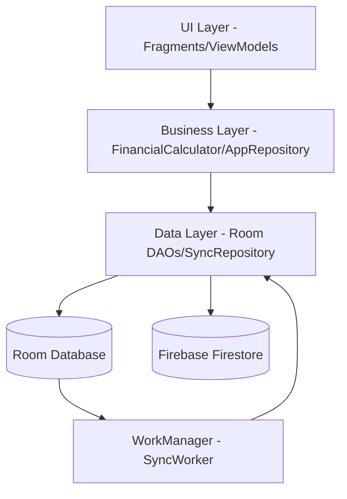
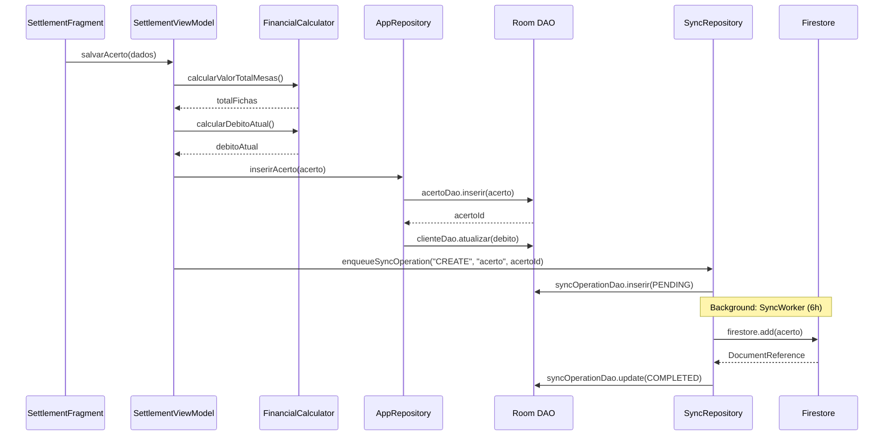

# 👨‍💻 DEV_GUIDE — GUIA DO DESENVOLVEDOR (E RUNBOOK)

> Protocolo de desenvolvimento, debugging e operação do projeto.
>
> **Versão:** 5.0 (Nota 10/10) 🎯  
> **Atualizado:** 28/01/2026  
> **Meta:** resolver problemas com **máximo 2 builds** e diagnóstico com evidência

---

## 🤖 MODO IA - PROTOCOLO DE ALTA AUTONOMIA

### Princípios de Execução
1. **Parar apenas após conclusão** (build + testes + validação)
2. **Máximo 2 builds** por problema
3. **Zero perguntas desnecessárias** (tudo está documentado)
4. **Comandos `.bat`** sempre (evita bloqueio Unix)
5. **ADB customizado** (`C:\Users\Rossiny\Desktop\2-GestaoBilhares\android-sdk\platform-tools\adb.exe`)

### Metodologia MCP (Mantida)
**Status:** ✅ Efetiva e implementada

**Hierarquia de uso:**
1. 🥇 **Documentação** (.cursor/rules) — SEMPRE
2. 🥈 **Comandos** — Apenas quando necessário
3. 🥉 **MCP Tools** — Operações específicas

**Ferramentas MCP validadas:**
- Filesystem MCP: edição de arquivos
- Perplexity MCP: pesquisas externas
- GitKraken MCP: controle de versão

**Motivo:** Reduz 10x tempo de busca, diagnóstico em 10 min vs 2h.

---

## 🚪 Protocolo obrigatório (Gates 0–4)

### Gate 0 — Diagnóstico (primeiro)

Decision tree:
```
PROBLEMA IDENTIFICADO
  ├─ Regressão / "funcionava antes"? → Static Analysis (máx 1 build)
  ├─ Erro visível lendo código?       → Static Analysis (máx 1 build)
  └─ Código parece OK mas falha?      → Dynamic Analysis (logs) (máx 2 builds)
```

Regra anti-loop:
- Se rodou Gradle mais de 2 vezes, **pare** e volte ao diagnóstico

### Gate 1 — Plano de correção
Defina objetivo cirúrgico, arquivo/linhas, mudança exata e validação mínima.

### Gate 2 — Escopo
Liste arquivos que vão mudar e os que NÃO vão ser tocados.

### Gate 3 — Execução incremental
Uma mudança por vez, validação imediata e rollback se piorar.

### Gate 4 — Parada obrigatória
Após 2 builds sem sucesso ou 3 tentativas, pare e reavalie (ou peça ajuda).

---

## 🔬 Receitas de diagnóstico (casos práticos)

### Caso 1: Campo está null

**Static Analysis:**
```kotlin
// 1. Encontrar criação do objeto
rg "HistoricoManutencao" --type kt -C 3

// 2. Ver construtor
data class HistoricoManutencao(
    val mesaId: Long,
    val usuarioId: Long?  // ← Nullable?
)

// 3. Ver instanciação
HistoricoManutencao(
    mesaId = 1
    // FALTA usuarioId!
)

// Solução:
HistoricoManutencao(
    mesaId = mesa.id,
    usuarioId = userSession.currentUser.id  // ← Adicionar
)
```

---

### Caso 2: Dados não aparecem na tela

**Static Analysis em camadas:**
```kotlin
// CAMADA 1: DAO - Query correta?
@Query("SELECT * FROM historico WHERE acertoId = :id")
// ✓ OK

// CAMADA 2: ViewModel - Transforma certo?
val items = repository.getHistorico(id)
    .groupBy { it.mesaId }  // ← Agrupando?

// CAMADA 3: UI - Observa certo?
items.collectAsState()  // StateFlow correto? ✓
```

---

### Caso 3: Regressão (funcionava antes)

**Arqueologia Git:**
```bash
# 1. Buscar onde era usado
rg "usuarioId" --type kt -C 5

# 2. Buscar método de agrupamento
rg "groupBy" --type kt

# 3. Histório Git
git log --all --oneline --grep="historico"
git blame SettlementViewModel.kt -L 450,470
```

**Análise:**
- Código antigo tinha `groupBy { it.mesaId }`
- Código atual retorna lista plana
- **Causa:** Refatoração removeu agrupamento

---

### Caso 4: PERMISSION_DENIED (Firestore)

**Diagnóstico sistemático:**
```bash
# 1. Ver regras atuais
cat firestore.rules | grep -A 10 "clientes"

# 2. Verificar path no código
Log.d("PATH", "Tentando acessar: ${docRef.path}")
```

```kotlin
// 3. Verificar campos obrigatórios
// Dados DEVEM ter:
data.empresa_id == empresaId  // ✓ Validado pelas rules
data.rota_id in rotasPermitidas  // ✓ Multi-tenancy
```

```bash
# 4. Verificar token do usuário (ADB customizado)
C:\Users\Rossiny\Desktop\2-GestaoBilhares\android-sdk\platform-tools\adb.exe logcat -s FirebaseAuth:D | grep "claims"
```

**Solução comum:**
- Path errado (fora de `entidades/items`)
- Campo `empresa_id` ou `rota_id` faltando
- `rotasPermitidas` não inclui a rota do dado

---

### Caso 5: Sincronização não funciona

**Checklist:**
```kotlin
// 1. Verificar fila de sync (Database Inspector)
SELECT * FROM sync_operations WHERE status = 'PENDING'
```

```bash
# 2. Verificar WorkManager (ADB customizado)
C:\Users\Rossiny\Desktop\2-GestaoBilhares\android-sdk\platform-tools\adb.exe logcat -s WM-WorkerWrapper:D
```

```kotlin
// 3. Verificar conectividade
Log.d("NETWORK", "Conectado: ${networkStatus.isConnected}")
```

```kotlin
// 4. Verificar retry count
SELECT * FROM sync_operations WHERE retryCount >= maxRetries
```

**Solução comum:**
- WorkManager não configurado no `Application`
- Sem permissão `INTERNET` no Manifest
- Fila com muitas operações `FAILED` → limpar

---

## 📝 Logs estruturados (padrão)

### Tags recomendadas
```kotlin
private const val TAG_DIAGNOSTICO = "[DIAGNOSTICO]"
private const val TAG_SYNC = "[SYNC]"
private const val TAG_CONFLICT = "[CONFLICT]"
private const val TAG_PATH = "[PATH]"
```

### Exemplos de uso
```kotlin
// Diagnóstico de fluxo
Log.d(TAG_DIAGNOSTICO, "INICIANDO salvarAcerto")
Log.d(TAG_DIAGNOSTICO, "ANTES: usuarioId=$usuarioId")
val historico = salvarHistorico(dados)
Log.d(TAG_DIAGNOSTICO, "DEPOIS: historicoId=${historico.id}")

// Sync
Log.d(TAG_SYNC, "📊 Operação ${op.id}: ${op.entityType}/${op.entityId}")
Log.d(TAG_SYNC, "🔄 Status: ${op.status}, Retry: ${op.retryCount}")
Log.d(TAG_SYNC, "❌ Erro: ${op.lastError}")

// Conflito
Log.w(TAG_CONFLICT, "🔍 CONFLITO: ${entityType}/${entityId}")
Log.w(TAG_CONFLICT, "   Local:  ${formatTimestamp(localTimestamp)}")
Log.w(TAG_CONFLICT, "   Remote: ${formatTimestamp(remoteTimestamp)}")
Log.w(TAG_CONFLICT, "   Winner: ${if (remoteTimestamp > localTimestamp) "REMOTE" else "LOCAL"}")

// Path
Log.d(TAG_PATH, "Acessando: ${docRef.path}")
```

### Capturar logs (ADB customizado)
```bash
# Path ADB
set ADB_PATH=C:\Users\Rossiny\Desktop\2-GestaoBilhares\android-sdk\platform-tools\adb.exe

# Filtro por tag
%ADB_PATH% logcat -s [DIAGNOSTICO]:D -v time

# Múltiplas tags
%ADB_PATH% logcat -s [DIAGNOSTICO]:D [SYNC]:D [CONFLICT]:D *:E

# Salvar em arquivo
%ADB_PATH% logcat > logs-28012026.txt
```

---

## 🔎 Comandos essenciais (uso consciente)

**Busca:**
```bash
rg "SettlementViewModel" --type kt -n
rg "sync_operations" --type kt -n
```

**Build mínimo (SEMPRE .bat):**
```bash
.\gradlew.bat :app:assembleDebug
```

**Logs (ADB customizado):**
```bash
set ADB_PATH=C:\Users\Rossiny\Desktop\2-GestaoBilhares\android-sdk\platform-tools\adb.exe
%ADB_PATH% logcat -s FirestoreSync:D FirebaseAuth:D *:E
%ADB_PATH% logcat -s [DIAGNOSTICO]:D -v time
```

**Git (regressão):**
```bash
git blame <arquivo> -L 450,470
git log --follow -p -- <arquivo>
```

---

## 🧠 Regras imutáveis

1. Multi-tenancy por rota (`rotasPermitidas`)
2. Offline-first (Room é fonte da verdade)
3. MVVM + Hilt + StateFlow
4. AppRepository é Facade (não refatorar sem análise completa)
5. Valores em reais (Double)
6. **Comandos `.bat`** sempre
7. **ADB customizado** (path completo)

---

## 🧯 Runbook operacional (produção)

### 1) PERMISSION_DENIED (Firestore)

Estrutura esperada:
```
/empresas/{empresaId}/entidades/{collectionName}/items/{itemId}
```

Claims esperadas:
```json
{
  "firebase_uid": "UID_DO_USUARIO",
  "empresa_id": "ID_EMPRESA",
  "rotasPermitidas": ["rota_1", "rota_2"],
  "nivel_acesso": "ADMIN|COLABORADOR",
  "aprovado": true
}
```

Checklist:
- Path fora do padrão?
- Campo `empresa_id` ausente/incorreto?
- Campo `rota_id` ausente/incorreto?
- Usuário não aprovado?
- Rota não está em `rotasPermitidas`?

Testar rules:
```bash
firebase emulators:start
firebase firestore:test --project=gestao-bilhares-dev --rules=firestore.rules
```

---

### 2) Sync travado (PENDING/FAILED)

Auditar fila (ADB customizado):
```bash
set ADB_PATH=C:\Users\Rossiny\Desktop\2-GestaoBilhares\android-sdk\platform-tools\adb.exe
%ADB_PATH% shell "run-as com.example.gestaobilhares sqlite3 databases/app.db 'SELECT COUNT(*) FROM sync_operations WHERE status="PENDING";'"
%ADB_PATH% shell "run-as com.example.gestaobilhares sqlite3 databases/app.db 'SELECT COUNT(*) FROM sync_operations WHERE status="FAILED";'"
```

Ações:
- Reprocessar falhas (resetar para PENDING e reagendar Worker)
- Identificar causa raiz no `lastError`

---

### 3) Dados "sumindo" / conflitos

- Comparar `dataUltimaAtualizacao` local vs remoto
- Conflito recorrente: considerar merge por entidade ou locking otimista (campo `version`)

---

### 4) Incidentes de produção

Severidade:
- **CRITICAL** (< 15 min): app inutilizável
- **HIGH** (< 1h): funcionalidade crítica
- **MEDIUM** (< 4h)
- **LOW** (< 24h)

Rollback (exemplos):
```bash
# App Distribution (usar secrets/)
firebase appdistribution:distribute --app=<APP_ID> --file=app/build/outputs/apk/debug/app-debug.apk --release-notes="Rollback v1.0"

# Rules
firebase firestore:rules:list
firebase firestore:rules:rollback --project=gestao-bilhares-prod --release-id=<RELEASE_ID>
```

---

### 5) Backup/Restore Firestore

Backup diário:
```bash
firebase firestore:export --project=gestao-bilhares-prod gs://gestao-bilhares-backups/backup-$(date +%Y%m%d)
```

Restore:
```bash
firebase firestore:import --project=gestao-bilhares-prod gs://gestao-bilhares-backups/backup-20260128 --confirm
```

---

## 📈 Monitoramento semanal (65 min)

Executar toda segunda, 9h:
- Violations (Rules) — 15 min
- Estrutura Firestore — 10 min
- Usage/Performance — 10 min
- Multi-tenancy (2 usuários) — 10 min
- Sync E2E — 15 min
- Logs — 5 min

Relatório: salvar em `monitoramento/relatorios/YYYY-MM-DD.md`.

---

## 🎯 Diagramas (Mermaid)

### Arquitetura


### Fluxo de Acerto


---

*Protocolo validado em produção — Janeiro/2026.*
